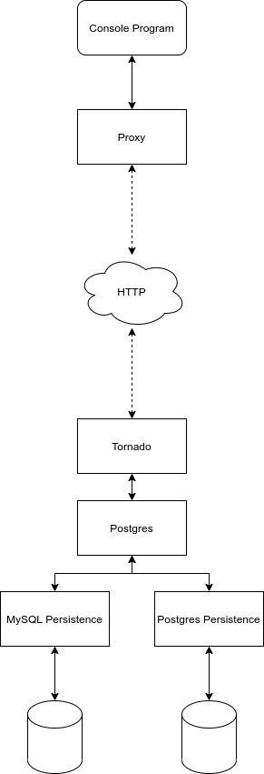

# Struttura dell'esempio

Esempio di disaccoppiamento di servizi usando web service.

*Schema concettuale*

## banca_dati

Simula un ipotetica libreria di persistenza di una banca dati.

La classe di base (persistence.py) ha due implementazioni concrete:
* mysql_persistence.py - finge di salvare in un db MySQL
* pg_persistence.py - finge di salvare in un db Postgres

Per lanciare questo componente:
```shell
python tornado_main.py
```

## proxy
E' letteralmente un _proxy_, o _client_, che nasconde ai programmi esterni, sia tornado che da command-line, i dettagli dell'implementazione.

In questo caso il proxy fa delle request REST ad un tornado che fa parte, logicamente, della banca dati.

## Applicativo a linea di comando

Questo componente può essere lanciato con
```shell 
python main.py
```

## Per attivare il virtual environment

```shell
source bin/activate
```

## Per installare le dependency

```shell
pip install -r requirements.txt
```
